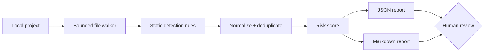

# Vibe Security Check

A defensive, explainable security preflight scanner for AI-generated websites and applications.

It helps builders using ChatGPT, Gemini, Replit, Base44, and other rapid-development tools catch common security mistakes before deployment—without executing the scanned project.

## What it checks

- Accidentally included `.env`, private-key, and credential files
- Likely hardcoded secrets and database credentials
- Dynamic code execution such as Python `eval`/`exec`
- Shell commands launched with unsafe interpolation
- Disabled TLS certificate verification
- Wildcard CORS configurations
- Production debug mode
- Unsafe HTML injection patterns
- Cookies missing secure protections
- Missing baseline repository safeguards such as `.gitignore`

Every finding includes severity, rule ID, file, line, evidence, risk explanation, and remediation guidance.

## Architecture



## Quick start

Requires Python 3.11+ and has no external dependencies.

```bash
python vibe_security_check.py path/to/project
python vibe_security_check.py path/to/project --format markdown --output security-report.md
python -m unittest discover -s tests -v
```

The command returns exit code `1` when high or critical findings exist, making it suitable for CI security gates.

## Example summary

```text
Vibe Security Check
Score: 71/100 | Risk: high
Critical: 0 | High: 1 | Medium: 2 | Low: 0
```

## Safe scanner design

- Never executes project code
- Never connects to discovered URLs, databases, or services
- Never prints full suspected secret values
- Skips binaries, oversized files, dependency folders, and Git metadata
- Uses bounded file sizes and a configurable file-count limit
- Produces findings for human verification rather than asserting exploitability

## Important limitations

This is a focused static preflight tool, not a penetration test, malware scanner, dependency-CVE database, cloud-configuration audit, or proof that an application is secure. Production systems still need dependency scanning, code review, threat modeling, access-control testing, deployment review, and qualified security assessment appropriate to their risk.

## Roadmap

- SARIF output for GitHub code scanning
- Framework-aware rules for Next.js, Flask, Django, and Express
- Dependency advisory integration using trusted package databases
- Pull-request annotations
- Local browser interface with drag-and-drop ZIP scanning
- Configurable policies for agencies and enterprise teams

## License

MIT

